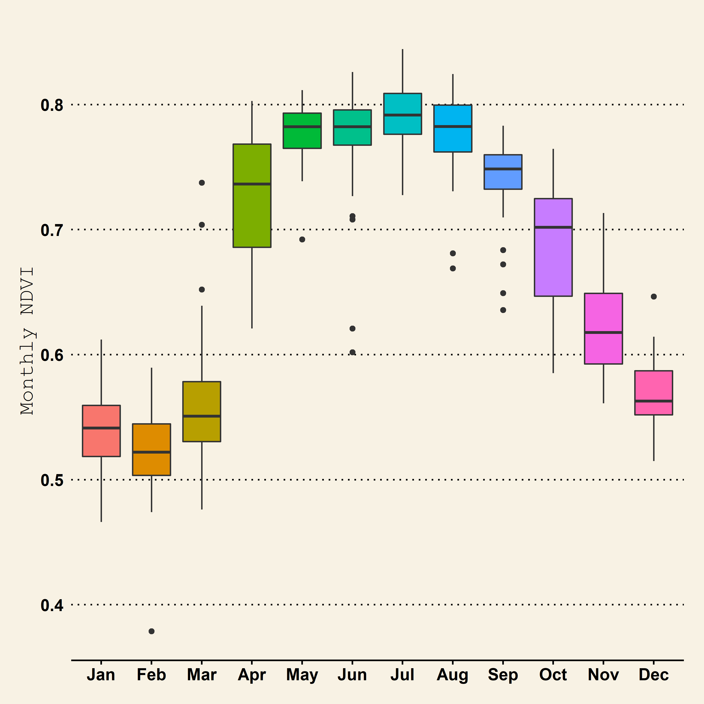
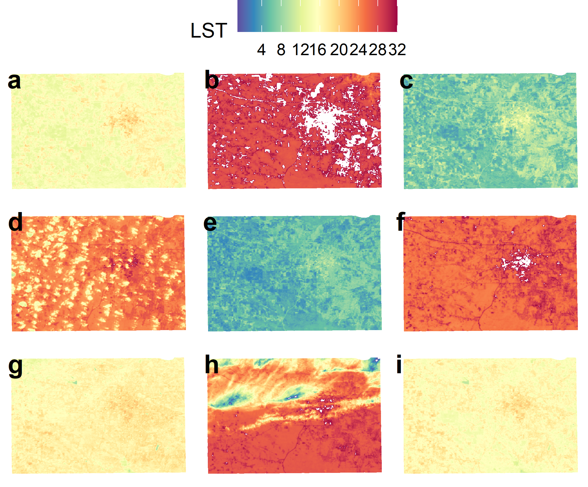

```{r setup, include = FALSE,echo=FALSE}
library("papaja") # formatting library
# loading R libraries
library(tidyverse)  # add  data analysis including ggplot
library (raster)       # raster data
library(rasterVis)   # raster visualization     
library(sp)          # spatial data processing          
library(rgdal)       # spatial data processing      
library(RStoolbox)   # Image analysis
library(ggplot2)     # plotting
library(gridExtra)   # plot arrangement
library(lubridate)  # date time
library(ggpubr) # arranging plots
library(ggspatial) # annotation 
library(reshape2)
r_refs("r-references.bib") # add all references 
```


# Introduction

Monitoring vegetation over time is an essential component of geographical resource management applications. On-site monitoring is frequently carried out by taking detailed measurements, such as canopy level measurements. In situ measurements are time-consuming, labor-intensive, and difficult to carry out over large geographic areas. Remote sensing, on the other hand, is a very viable option for monitoring numerous vegetation characteristics using various vegetation indices such as Normalized Difference Vegetation Index, Near-Infrared / Red Ratio, Soil and atmospherically resistant vegetation index [@im2008hyperspectral]. The natural and anthropogenic features found on the Earth's surface are referred to as land cover. Examples include deciduous forests, wetlands, developed/built-up areas, grasslands, and water. Land use, on the other hand, describes the activities that take place on the land and indicates the current use of the land. Examples include residential homes, shopping centers, tree nurseries, state parks, and reservoirs. Land cover and land use are frequently studied together in remote sensing studies because satellite imagery and aerial photography can identify land cover, but inferring land use often requires more knowledge of the study region, so a compromise is sometimes made between identifying the variable of interest and inferring land use [@fonji2014using]. 

Local and place-specific global climate change (LULCC) is a type of global climate change, and these changes add up to global climate change. These changes, in turn, have an impact on other components of our earth-atmosphere system, frequently leading to negative outcomes such as biodiversity loss, desertification, and climate change. Several methods exist for tracking or detecting changes in land cover over time. Previously, researchers mapped LULCC over smaller areas using field data and aerial photographs. Because satellite images can cover large geographic areas and have a long temporal coverage, remote sensing is an excellent tool for studying LULCC [@jensen1986introductory ;@berlanga2002land].

Land cover changes can occur as a result of both human and climate drivers. For example, the demand for new settlements often results in the permanent loss of natural land, resulting in changes in the weather patterns, temperature, and precipitation [@hale2006land;@pielke2007overview]. Disturbance events such as wildfire and timber harvest are important factors influencing land cover. From 1985 to 2010, forest disturbances affected an average of approximately 11200 square miles per year in the contiguous United States, according to the North American forest dynamic dataset. The rate of forest disturbance decreased by about one-third between 2006 and 2010[@reidmiller2019fourth].

The relationship between LST and NDVI is fascinating because it draws remote sensing scientists worldwide. The nature and strength of this relationship are strongly influenced by space and time. NDVI, on the other hand, is heavily influenced by seasonal variations in land cover. Seasonal changes also influence LST[@guha2020land].

In this mini paper, the **objectives** are (a) to present the results of an analysis of the Historical land surface temperature and precipitation data, (b) to quantify normalized vegetation index and land surface temperature for five years, and estimate the land cover /land use, (c) to determine the relationship  between vegetation and land use.

# Methods and Materials

## Study area

Oktibbeha County is a micropolitan county in east-central Mississippi that is home to Starkville city and Mississippi State University. The county is located within Mississippi's golden triangle region. The name of the county is derived from a Native American term that means "bloody water" or "icy creek" [@gannett1902origin]. Its area is approximately 118 square kilometers, and it borders six other counties: Lowndes, Winstons, Noxubee, Webster, Choctaw, and Claw. According to the 2020 United States Census, the county had 51,788 people, 17,798 households, and 9,263 families.

```{r echo=FALSE,fig.cap='Study Map of Oktibbeha County, Mississippi, USA'}
knitr::include_graphics('Figures_or_Maps/Oktibbeha.png')
```
Oktibbeha County and the city of Starkville are thriving communities that have grown dramatically in the last fifty years. The central east/west corridor connecting Mississippi and Alabama is US Highway 82. It cuts through the northern half of Oktibbeha County and serves as the primary regional transportation network. The county has a diverse landscape and terrain, including small lakes, creeks, swamps, forests, etc.One-third of the country is flatwood, which is well suited to growing pine timber. The remainder of the county on the western side is very productive of pine timber and produces row crops well, especially if fertilized [@fox1905oktibbeha]. When creating a land-use map, residential areas to industrial areas are considered built up, lakes, rivers, canals, and wetland areas are considered water, and more miniature forests to densely forested areas, including parks, are considered vegetation. It is located within three physiographic regions. The eastern portion extends into the black or northeastern Prairie regions, while the Pontotoc ridge bounds the western portion. Interior Flatwoods encompass the western portion of the county. Predominantly pine-covered regions in the southeastern United States are also found. The county's elevation ranges from 50m in the Tibble Creek floodplain in the northeastern corner to 180m in the southwestern corner[@leidolf2002flora;@brent1973soil].

## Data collection

Landsat8 imageries (land 8-9 OLI /tirs c2 l1: Landsat 8 Operational Land Imager/Thermal Infrared Sensors) from 2018 to 2022 for February/March and June with less than 10% cloud were downloaded from USGS earth explorer[https://earthexplorer.usgs.gov/]. Moreover, eight-day composite of Precipitation data from 2000 to 2022 was part of "GPM: Monthly Global Precipitation Measurement (GPM)". Furthermore, Land Surface Temperature was part of "MOD11A2.006 Terra Land Surface Temperature and Emissivity 8-Day Global 1km". Historical NDVI data was also downloaded from MODIS/Terra Vegetation database 'MOD13A1.006 Terra Vegetation Indices 16-Day Global 500m' via Google earth engine. Then Precipitation and land surface temperature data were clipped with the study area. Then they are converted comma separated format for further analysis. Apartment these, Temporal Land Surface Temperature and NDVI were extracted from 30 meters Landsat 8 imageries.

Table Landsat 8 data description

| Bands                      | Wave length (micrometer) | Resolution (meter) |
|----------------------------|--------------------------|--------------------|
| Band 1-Coastal aerosol     | 0.43-0.45                | 30                 |
| Band 2-Blue                | 0.45-0.51                | 30                 |
| Band 3- Green              | 0.53-0.59                | 30                 |
| Band 4-Red                 | 0.64-0.67                | 30                 |
| Band 5-Near Infrared       | 0.85-0.88                | 30                 |
| Band 6- SWIR 1             | 1.57-1.65                | 30                 |
| Band 7- SWIR 2             | 2.11-2.29                | 30                 |
| Band 8-Panchromatic        | 0.50-0.68                | 15                 |
| Band 9-Cirrus              | 1.36-1.38                | 30                 |
| Band 10-Thermal infrared 1 | 10.60-11.19              | 100                |
| Band 11-Thermal infrared 2 | 11.50-12.51              | 100                |

: Row/Path: 22/ 37

## NDVI calculation

For the vegetation analysis, we used Normalized Difference Vegetation Index (NDVI).NDVI is a dimensionless index that depicts the difference between the reflectance of vegetation in the visible and near-infrared spectrum. It can be used to assess changes in plant health and vegetation density [@tucker2001higher]. An NDVI is calculated as a ratio of the red (R) value and the near-infrared (NIR) value. It ranges from -1.0 to 1.0, mainly representing greens, where negative values are mainly made up of clouds, snow, and water, and values close to zero are primarily made up of rocks and bare soil. A very low NDVI value (0.1 or less) corresponds to empty areas of rocks, sand, or snow. Moderate values (between 0.2 and 0.3) represent shrubs and meadows, while large values (between 0.6 and 0.8) indicate temperate and tropical forests. for the Landsat 8, the formula is expressed as follows
$NDVI=\frac{BAND 5 - Band 4}{Band 5 + Band 4}---(1)$

 
## Correlation analysis 

Correlation analysis is a statistical method used to examine the relationship between two or more variables. The correlation coefficients range between -1 and 1. 0 indicates no relationship between variables, -1 indicates negative, and +1 indicates positive correlation.
 The equation of the Correlation Coefficient is given below.
 
$r_{X, Y}=\frac{\operatorname{cov}(X, Y)}{\sigma_{X} \sigma_{Y}}=\dfrac{\sum_{i=1}^{n}\left(X_{i}-\bar{X}\right)\left(Y_{i}-\bar{Y}\right)}{\sqrt{{\Sigma}_{\Sigma_{i}=1}^{n}\left(X_{i}-\bar{X}\right)^{2}} \sqrt{{\sum}_{\Sigma_{i}=1}^{n}\left(Y_{i}-\bar{Y}\right)^{2}}}---(2)$
 where X and Y are variables.

## Land use/land cover classification
In order to classify land use/land cover from Landsat images from 2018 to 2022, a support vector machine algorithm was used.

| Classes      | Description                                                                         |
|------------|:-----------------------------------------------------|
| Vegetation   | Forest, mixed forest lands, palms, grasses, conifer, and scrub.                     |
| Built up     | Residential areas, industrial, transportation, roads, mixed urban, and other urban. |
| Baresoil     | Land with exposed soil and soil without grasses.                                    |
| Water bodies | River, channel, creeks, lakes, wetland, streams and land with water.                |

## Support vector machine

Support vector machines are not parametric classifiers. It was proposed by the @vapnik2015uniform and later explained by @vapnik1999overview. SMV can be easily trained by separable classes. If the training data with k number of samples, then it is represented as ${X_i y_i},i=1,..k$ where $X ∈ R^N$ is an N dimensional space and $Y ∈ {-1,+1}$ is classes label ,then these classes are linearly separable if there a vector W which perpendicular to the linear hyperplane and a scaler b  indicating the offset of the separating hyperplane from the origin$. 

These can be expressed as 
$WX_i + b \ge +1 $ for all y =+1,i.e a member of class 1   \n
$WX_i + b \le -1 $ for all y =-1,i.e a member of class 2 $---(3)$


## Land surface temperature and precipitation data analysis

```{r include = FALSE,echo=FALSE}
# reading data
lst<- read_csv("data/landsurface temperature2010_22.csv") %>% rename('date'='system:time_start')
Prci<-read_csv("data/Precipitation1998_19.csv")
ndvi<- read_csv('data/NDVI2000_2022.csv') %>%  rename('date'='system:time_start')
```

## Landsat satellite imageries preprocessing


Landsat sensors capture reflected energy and store data as 8-bit digital numbers (DNs). USGS data includes metadata. The first step is to convert DN to radiance and then radiance to top of reflectance by using provided metadata. The conversion of DNs to Top of Atmospheric reflactance was done via the following equations.

$L_\lambda = M_L Q_{cal} + A_L---(4)$

where
$L_\lambda$ = TOA spectral radiance $(Watts/( m^2 * srad * μm))$
$M_L$ =Band-specific multiplicative rescaling factor from the metadata (RADIANCE_MULT_BAND_x, where x is the band number)
AL=Band-specific additive rescaling factor from the metadata (RADIANCE_ADD_BAND_x, where x is the band number)
$Q_{cal}$ =  Quantized and calibrated standard product pixel values (DN)  

For the purpose for calculating Land surface temperature . The Conversion Top of Atmospheric reflactance to At satellite brightness temperature was done via the following equation.

$T = \frac{K_2}{\ln \big( \frac{K_1}{{L _ \lambda} }+ 1 \big)} ---(5)$

where

T  =  Top of atmosphere brightness temperature (Kelvin)
$L_\lambda$  =TOA spectral radiance $(Watts/( m^2 * srad * μm))$
$K_1$  =Band-specific thermal conversion constant from the metadata (K1_CONSTANT_BAND_x, where x is the thermal band number), $K_2$  =Band-specific thermal conversion constant from the metadata (K2_CONSTANT_BAND_x, where x is the thermal band number). All associate values were taken from meta data of each scene.

# Results and discussions

## Historical Land surface temperature and precipitation

```{r echo=FALSE}
# date change character to date time from lubridate library
lst$date<- mdy(lst$date)
# precipitation 
Prci$date<- mdy(Prci$date)
# ndvi from modis/terra
ndvi$date<-dmy(ndvi$date)
# adding column as month 
lst$Month<- month(lst$date,label = TRUE)
Prci$Month<- month(Prci$date,label = TRUE)
ndvi$Month<- month(ndvi$date,label=TRUE)
# making table as descriptive statistics
lst_description<- lst %>% 
  group_by(Month) %>% 
  summarize(Mean=round(mean(LST_Day_1km,na.rm=TRUE),2),
            Median=round(median(LST_Day_1km,na.rm=TRUE),2),
            Max=round(max(LST_Day_1km,na.rm=TRUE),2),
            Min=round(min(LST_Day_1km,na.rm=TRUE),2),
            SD=round(sd(LST_Day_1km,na.rm=TRUE),2))
lst_description[,-1] <- printnum(lst_description[,-1])


```


```{r echo=FALSE}
# same descriptive table
prc_description<- Prci %>% 
  group_by(Month) %>% 
  summarize(Mean=round(mean(precipitation,na.rm=TRUE),2),
            Median=round(median(precipitation,na.rm=TRUE),2),
            Max=round(max(precipitation,na.rm=TRUE),2),
            Min=round(min(precipitation,na.rm=TRUE),2),
            SD=round(sd(precipitation,na.rm=TRUE),2))
prc_description[,-1] <- printnum(prc_description[,-1])


```

```{r echo=FALSE, results=FALSE}
# they are used for writing 
tmp_mean<-mean(round(as.numeric(lst_description$Mean),0))
tmp_sd<-mean(round(as.numeric(lst_description$SD),0))
```

Throughout the year, the average land surface temperature (LST) ranges from 9 $^0C$ to 28 $^0C$. The monthly average temperature is `r printnum(tmp_mean)` $^0C$ and the standard deviation is `r printnum(tmp_sd)`. January has the coldest LST at 9.16 $^0C$, and July has the hottest LST at 28.55$^0C$. According to data recorded between 2010 and 2022, January and December experienced the lowest LST, ranging from -0.5 to -0.3$^0C$, whereas August and June, experienced higher LST, ranging from 35.5 $^0C$ to 33.77$^0C$ (see table 1 and figure 2).

```{r echo=FALSE, message=FALSE, warning=FALSE, results=FALSE}
lst_month<- ggplot(na.omit(lst)) +
  aes(x = Month, y = LST_Day_1km, fill = Month) +
  geom_boxplot(shape = "circle") +
  scale_fill_hue(direction = 1) +
  scale_color_hue(direction = 1) +
  ggthemes::theme_wsj() +
  theme(legend.position = "none")+
 ggplot2::labs(
    x = "Months",
    y = "Land surface temperature (C)",
    fill = "Month"
  ) +
  theme(axis.title.y = element_text(size=15))

#ggsave(plot=lst_month,path='Figures_or_Maps',file='lst_month.png',dpi = 300,scale = 3.5, #width = 3,height = 2, units = "in")
ggsave("Figures_or_Maps/lst_month.png",plot=lst_month,device="png",dpi=500)

```

```{r echo=FALSE, message=FALSE, warning=FALSE, results=FALSE}

pre_month<- ggplot(na.omit(Prci)) +
  aes(x = Month, y = precipitation, fill = Month) +
  geom_boxplot(shape = "circle") +
  scale_fill_hue(direction = 1) +
  scale_color_hue(direction = 1) +
  ggthemes::theme_wsj() +
  theme(legend.position = "none")+
 ggplot2::labs(
    x = "Months",
    y = "Monthly Precipitation (mm/hr)",
    fill = "Month"
  ) +
  theme(axis.title.y = element_text(size=15))

#ggsave(plot=lst_month,path='Figures_or_Maps',file='lst_month.png',dpi = 300,scale = 3.5, #width = 3,height = 2, units = "in")
ggsave("Figures_or_Maps/pre_month.png",plot=pre_month,device="png",dpi=500)


#ndvi
ndvi_description<- ndvi %>% 
  group_by(Month) %>% 
  summarize(Mean=round(mean(NDVI,na.rm=TRUE),2),
            Median=round(median(NDVI,na.rm=TRUE),2),
            Max=round(max(NDVI,na.rm=TRUE),2),
            Min=round(min(NDVI,na.rm=TRUE),2),
            SD=round(sd(NDVI,na.rm=TRUE),2))
ndvi_description[,-1] <- printnum(ndvi_description[,-1])

pre_month<- ggplot(na.omit(ndvi)) +
  aes(x = Month, y = NDVI, fill = Month) +
  geom_boxplot(shape = "circle") +
  scale_fill_hue(direction = 1) +
  scale_color_hue(direction = 1) +
  ggthemes::theme_wsj() +
  theme(legend.position = "none")+
 ggplot2::labs(
    x = "Months",
    y = "Monthly NDVI",
    fill = "Month"
  ) +
  theme(axis.title.y = element_text(size=15))
ggsave("Figures_or_Maps/ndvi_month.png",plot=pre_month,device="png",dpi=500)

```

```{r echo=FALSE,fig.cap='Boxplot of Land surface temperature'}
knitr::include_graphics('Figures_or_Maps/lst_month.png')

```


Monthly precipitation data covered a period of over 20 years. During this period, the average precipitation rate ranged from 0.12 to 0.22 $mm/hr$. These rates remained relatively constant throughout the month. December to April had a higher precipitation rate of around 0.40 $mm/hr$, while August to November had a lower rate ranging from 0.05 to 0 $mm/hr$ (see table 2 and figure 3). 

```{r echo=FALSE,fig.cap='Boxplot of Monthly Precipitation (mm/hr)'}
knitr::include_graphics('Figures_or_Maps/pre_month.png')

```

```{r echo=FALSE}

apa_table(lst_description,
          caption = 'Descriptive statistics of Land surface temperature',
          note = 'MOD11A2.006 Terra Land Surface Temperature and Emissivity 8-Day Global 1km ',
          escape = TRUE)
```

Monthly land surface temperature.

```{r echo=FALSE}
apa_table(prc_description,
          caption = 'Descriptive statistics of Precipitation (mm/hr)',
          note = 'GPM: Monthly Global Precipitation Measurement (GPM) v6 ',
          escape = TRUE)
```


Looking at the image (NDVI), it is understood that every year due to the development of the city, the vegetation is changing in one place or another. The change between red and green is clearly seen in the image.

```{r echo=FALSE}
apa_table(ndvi_description,
          caption = 'Descriptive statistics of NDVI',
          note = 'MOD11A2.006 Terra Land Surface Temperature and Emissivity 8-Day Global 1km ',
          escape = TRUE)
```

December to March has the lowest NDVI which means County doesn't contain less vegetation during these months while May to October shows a higher NDVI which means County has healthier vegetation. The most variable months are April and October according to Global MODIS/Terra data.

```{r echo=FALSE,fig.cap=' Monthly NDVI of the Oktibbeha County'}


```


## Spatio- Temporal distriution of Vegetation and Land surface temperature analysis

It is quite intriguing that Global MODIS/Terra NDVI don't have any negative values. The reason for this may be the lower resolution or long-term daily average to the monthly average. The 30-meter Landsat 8 maps, on the other hand, showed negative NDVI values, which typically correspond to pixels associated with water or flooded marshes. For an ideal NDVI value of 1, a canopy that is fully alive has an NDVI of zero.

```{r echo=FALSE,fig.cap=' Normalized Difference Vegetation Index Map of Oktibbeha County. In this subplot, label a starts with February of 2018, and the last label i indicated March of 2022'}
knitr::include_graphics('Figures_or_Maps/ndvimap.png')
```

Oktibbeha county covered much vegetation Throughout the different years. This was at least proved from 2018 to 2022. However, Starkville city had only a lower NDVI value which was spotted as brightness colored in the figure. Starkville experienced a bit more urbanization due to its urban infrastructures and university-based population, and growth exception occurred in the d labeled. This image contained a little more cloud. The cloud has only appeared in this image, but vegetation still was spotted as dark green. Due to the spot time of this work, the cloud removal process did not apply. That's why the cloud still remained in that image. Overall other images were well enough to make a conclusion about the vegetation distribution for the Oktibbeha county. 

## Relationship between NDVI vs LST

It is clear that there is a correlation between vegetation and land surface temperature. In Oktibbeha county, for instance, the temperatures and NDVI are lower from November to March, while they are higher from April to  October (see figure 6). 
```{r echo=FALSE,fig.cap=' Land Surface Temperature and NDVI relationship'}
knitr::include_graphics('Figures_or_Maps/ndvilst.png')
```

R squared value of 0.88 indicates that there is a good relationship between remotely observed NDVI and Land Surface temperature (see the Figure 6).

## Spatio- Temporal distriution of Land surface temperature analysis
```{r echo=FALSE,fig.cap=' Map of the  Land Surface Temperature for the Oktibbeha county. Here  a starts with March of 2018, then b is the June of 2018 and likelywise i labels is the March of 2022'}

```

## Spatio- Temporal Land use/land cover analysis

```{r echo=FALSE,fig.cap='Land cover /Land use map of the Oktibbeha county  '}
knitr::include_graphics('Figures_or_Maps/landcover.png')

```

```{r echo=FALSE, message=FALSE, warning=FALSE}
landcover <- read_csv("data/landcover.csv")
landcover[,-1] <- printnum(landcover[,-1])
apa_table(landcover,
          caption = 'Result of Land cover/Land use classification',
          escape = TRUE)
```

The table and Figure reveal both positive and negative changes that occurred in the land use/cover pattern of Oktibbeha county. In 2018, built-up area areas were 343.67 square kilometers, and after 2022 it increased, whereas the opposite thing happened in vegetation. It was 1346 square kilometers, but after 2021, it became 820 square kilometers. 

```{r echo=FALSE,fig.cap='Land cover /Land use barplot of Oktibbeha county'}
knitr::include_graphics('Figures_or_Maps/landcoverbar.png')
```

According to the figure 8 and 9, the most variable land cover classes are bare soil, roads/highways, and vegetation. As a five-year analysis of land cover/land use (see figure 9), there is one thing clear vegetated or forested areas are the dominant area in the Oktibbeha county. The Oktibbeha Starkville city has the most built-up area colored in red. The built-up areas are slowly increasing from 2018 to 2020. However, water bodies are not significantly detected due to lower resolution or sampling error. Other classes lie barren land is constant across the years—the change and result of classified areas in the squared kilometers. 

As a result of the subtropical latitude of Oktibbeha county and the extensive lands to the north, the county's climate is warm and humid. It is also influenced by warm temperatures from the Gulf of Mexico [@brent1973soil]. The average annual precipitation is 141.86 cm, with monthly precipitation ranging from 8.23 cm in October to 15.24 cm in March. The wettest seasons are winter and spring, with fall being the driest. Snow is uncommon and only lasts for a short time on the ground. The average temperature in this county ranges from 5.2 degrees Celsius in January to a high of 27 degrees Celsius in July. The average number of frost-free days (above O degrees C) in a year is 226[@leidolf2002flora]. 

# Conclusion

The Landsat satellite imageries have been analyzed for the vegetation monitoring and estimation of land use from 2020 to 2022 along with land surface temperature and precipitation in Oktiheba county, Mississippi.Image classification is so accurate because training samples were very small. The other potential reason is that Feb, march, and June were collected for 30-meter resolution.  So satellites images had lower resolution and large cloud coverage. Cloud be removed further advanced analysis but this study has designated for only Spring 2022.The purpose of this study was to explore the use of R markdown for analyzing geospatial data and reproducing publishable scientific manuscripts.  It has been shown that the R markdown package can be used for data preprocessing, analysis, visualization, and creation of maps, tables, and articles. 

\newpage

# used R libraries

We used `r cite_r("r-references.bib")` for all our analyses.

# References

```{=tex}
\begingroup
\setlength{\parindent}{-0.5in}
\setlength{\leftskip}{0.5in}
```
::: {#refs custom-style="Bibliography"}
:::

```{=tex}
\endgroup
```
