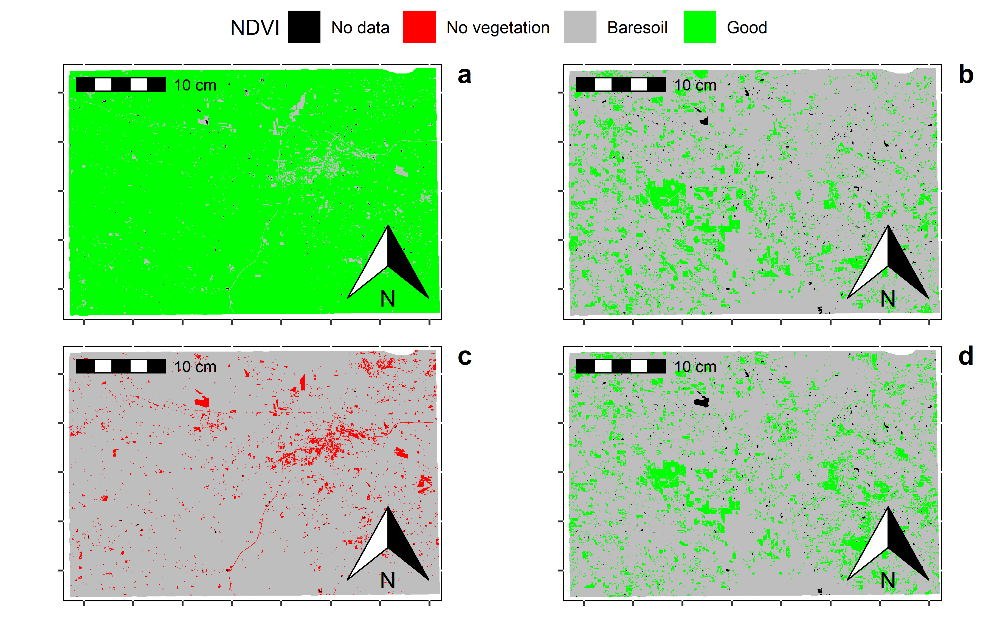

```{r setup, include = FALSE,echo=FALSE}
library("papaja") # formatting library
# loading R libraries
library(tidyverse)  # add  data analysis including ggplot
library (raster)       # raster data
library(rasterVis)   # raster visualization     
library(sp)          # spatial data processing          
library(rgdal)       # spatial data processing      
library(RStoolbox)   # Image analysis
library(ggplot2)     # plotting
library(gridExtra)   # plot arrangement
library(lubridate)  # date time
library(ggpubr) # arranging plots
library(ggspatial) # annotation 
library(reshape2)
r_refs("r-references.bib") # add all references 
```


# Introduction

<p align="justify"> Monitoring vegetation over time is an essential component of geographical resource management applications. On-site monitoring is frequently carried out by taking detailed measurements, such as canopy level measurements. In situ measurements are time-consuming, labor-intensive, and difficult to carry out over large geographic areas. Remote sensing, on the other hand, is a very viable option for monitoring numerous vegetation characteristics using various vegetation indices such as Normalized Difference Vegetation Index, Near-Infrared / Red Ratio, Soil and atmospherically resistant vegetation index [@im2008hyperspectral]. The natural and anthropogenic features found on the Earth's surface are referred to as land cover. Examples include deciduous forests, wetlands, developed/built up areas, grasslands, and water. Land use, on the other hand, describes the activities that take place on the land and indicates the current use of the land. Examples include residential homes, shopping centers, tree nurseries, state parks, and reservoirs. Land cover and land use are frequently studied together in remote sensing studies because satellite imagery and aerial photography can identify land cover, but inferring land use often requires more knowledge of the study region, so a compromise is sometimes made between identifying the variable of interest and inferring land use [@fonji2014using]. 

Local and place-specific global climate change (LULCC) is a type of global climate change, and these changes add up to global climate change. These changes, in turn, have an impact on other components of our earth-atmosphere system, frequently leading to negative outcomes such as biodiversity loss, desertification, and climate change. Several methods exist for tracking or detecting changes in land cover over time. Previously, researchers mapped LULCC over smaller areas using field data and aerial photographs. Because satellite images can cover large geographic areas and have a long temporal coverage, remote sensing is an excellent tool for studying LULCC [@jensen1986introductory ;@berlanga2002land].</p>

Land cover changes can occur as a result of both human and climate drivers. For example, the demand for new settlements often results in the permanent loss of natural land, resulting in changes in the weather patterns, temperature, and precipitation [@hale2006land;@pielke2007overview]. Disturbance events such as wildfire and timber harvest are important factors influencing land cover. From 1985 to 2010, forest disturbances affected an average of approximately 11200 square miles per year in the contiguous United States, according to the North American forest dynamic dataset. The rate of forest disturbance decreased by about one-third between 2006 and 2010[@reidmiller2019fourth].


In this mini paper, the **objectives** are (a) to present results of an analysis of the land surface temperature and precipitation data, (b) to quantify normalized vegetation index for three years and estimate the land use /land cover, (c) to determine the relationship  between vegetation and land use.

# Methods and Materials

## Study area

Oktibbeha County is a micropolitan county in east-central Mississippi that is home to Starkville city and Mississippi State University. The county is located within Mississippi's golden triangle region. The name of the county is derived from a Native American term that means "bloody water" or "icy creek" [@gannett1902origin]. Its area is approximately 118 square kilometers, and it borders six other counties: Lowndes, Winstons, Noxubee, Webster, Choctaw, and Claw. According to the 2020 United States Census, the county had 51,788 people, 17,798 households, and 9,263 families.


```{r echo=FALSE,fig.cap=' Study Map of Oktibbeha county'}
shp <- sf::st_read('data/raster_vector/Oktibbeha.shp')
msp <- sf::st_read('data/raster_vector/Mississippi.shp')
#shp<- fortify(shp)
#msp<- fortify(msp)
Oktibbeha<- ggplot() + geom_polygon(data = shp, aes(x = long, y = lat, group = group), colour = "black", fill = 'grey')

ggm1<- ggplot() + 
  geom_sf(data = msp, fill = "white") + 
  geom_sf(data = shp, fill = NA, color = "red", size = 1.2) +
  theme_void()
ggm2<- ggplot()+
  geom_sf(data = shp, fill = 'blue', color = "red", size = 1.2)+
  theme(plot.background = element_rect(fill = "#BFD5E3"))
  
Oktibbeha<- cowplot::ggdraw() +
  cowplot::draw_plot(ggm2) +
  cowplot::draw_plot(ggm1, x = 0.02, y = 0.65, width = 0.35, height = 0.35)

ggsave("Figures_or_Maps/Oktibbeha.png",plot=Oktibbeha,device="png",dpi=500)
knitr::include_graphics('Figures_or_Maps/Oktibbeha.png')
```
Oktibbeha County and the city of Starkville are thriving communities that have grown dramatically in the last fifty years. The central east/west corridor connecting Mississippi and Alabama is US Highway 82. It cuts through the northern half of Oktibbeha County and serves as the primary regional transportation network. The county has a diverse landscape and terrain, including small lakes, creeks, swamps, forests, etc.One-third of the country is flatwood, which is well suited to growing pine timber. The remainder of the county on the western side is very productive of pine timber and produces row crops well, especially if fertilized [@fox1905oktibbeha]. When creating a land-use map, residential areas to industrial areas are considered built up, lakes, rivers, canals, and wetland areas are considered water, and more miniature forests to densely forested areas, including parks, are considered vegetation. It is located within three physiographic regions. The eastern portion extends into the black or northeastern Prairie regions, while the Pontotoc ridge bounds the western portion. Interior Flatwoods encompass the western portion of the county. Predominantly pine-covered regions in the southeastern United States are also found. The county's elevation ranges from 50m in the Tibble Creek floodplain in the northeastern corner to 180m in the southwestern corner[@leidolf2002flora;@brent1973soil].

## Data collection

Landsat8 imageries (land 8-9 OLI /tirs c2 l1    ) from 2020 to 2022 for February and June with less than 10% cloud were downloaded from USGS earth explorer[https://earthexplorer.usgs.gov/]. Moreover, eight-day composite of Precipitation data from 2000 to 2022 was part of "GPM: Monthly Global Precipitation Measurement (GPM)" . Furthermore, Land Surface Temperature was part of "MOD11A2.006 Terra Land Surface Temperature and Emissivity 8-Day Global 1km" . Then Precipitation and land surface temperature data were clipped with the study area. Then they are converted comma separated format for further analysis.

Table Landsat 8 data description

| Bands                      | Wave length (micrometer) | Resolution (meter) |
|----------------------------|--------------------------|--------------------|
| Band 1-Coastal aerosol     | 0.43-0.45                | 30                 |
| Band 2-Blue                | 0.45-0.51                | 30                 |
| Band 3- Green              | 0.53-0.59                | 30                 |
| Band 4-Red                 | 0.64-0.67                | 30                 |
| Band 5-Near Infrared       | 0.85-0.88                | 30                 |
| Band 6- SWIR 1             | 1.57-1.65                | 30                 |
| Band 7- SWIR 2             | 2.11-2.29                | 30                 |
| Band 8-Panchromatic        | 0.50-0.68                | 15                 |
| Band 9-Cirrus              | 1.36-1.38                | 30                 |
| Band 10-Thermal infrared 1 | 10.60-11.19              | 100                |
| Band 11-Thermal infrared 2 | 11.50-12.51              | 100                |

: Land 8-9 OLI /tirs c2 l1

## NDVI calculation

For the vegetation analysis, we used Normalized Difference Vegetation Index (NDVI).NDVI is a dimensionless index that depicts the difference between the reflectance of vegetation in the visible and near-infrared spectrum.It can be used to assess changes in plant health and vegetation density [@tucker2001higher]. An NDVI is calculated as a ratio of the red (R) value and the near-infrared (NIR) value. It ranges from -1.0 to 1.0, mainly representing greens, where negative values are mainly made up of clouds, snow, and water, and values close to zero are primarily made up of rocks and bare soil. A very low NDVI value (0.1 or less) corresponds to empty areas of rocks, sand, or snow. Moderate values (between 0.2 and 0.3) represent shrubs and meadows, while large values (between 0.6 and 0.8) indicate temperate and tropical forests.

for the Landsat 8, the formula is given 
$NDVI=\frac{BAND 5 - Band 4}{Band 5 + Band 4}$

 Band 5-- reflection in the near-infrared spectrum 
 
 Band 4 -- reflection in the red range of the spectrum 
 
## Correlation analysis 

Correlation analysis is a statistical method used to examine the relationship between two or more variables. The correlation coefficients range between -1 and 1. 0 indicates no relationship between variables, -1 indicates negative, and +1 indicates positive correlation.
 The equation of Correlation Coefficient is given below.
 
$r_{X, Y}=\frac{\operatorname{cov}(X, Y)}{\sigma_{X} \sigma_{Y}}=\dfrac{\sum_{i=1}^{n}\left(X_{i}-\bar{X}\right)\left(Y_{i}-\bar{Y}\right)}{\sqrt{{\Sigma}_{\Sigma_{i}=1}^{n}\left(X_{i}-\bar{X}\right)^{2}} \sqrt{{\sum}_{\Sigma_{i}=1}^{n}\left(Y_{i}-\bar{Y}\right)^{2}}}$
 where X and Y are variables.


## Land surface temperature and precipitation data analysis

```{r include = FALSE,echo=FALSE}
# reading data
lst<- read_csv("data/landsurface temperature2010_22.csv")
Prci<-read_csv("data/Precipitation1998_19.csv")

```

## Landsate satellite imageries preprocessing


```{r message=FALSE, warning=FALSE,echo=FALSE}
# loading raster and meta data 
# Landsat 8-9 OLI/TIRS C2 L1
# un zipping 
# for (i in 1:5){
#   untar(list.files()[i],exdir=substr(list.files()[i],1,40))
#   print(paste0('finished untaring /unzipping',list.files()[i]))}
# 
# meta<- list.files('data/raster_vector',pattern = '.txt')
# meta
```

```{r echo=FALSE}
# empty vector 
# metafiles<- c()
# # append all names in the metafile vector 
# for (i in 1:4){
#   mfilesnames<-paste0('meta_',substr(meta[i],18,25))
#   metafiles<- c(metafiles, mfilesnames)
# }
# 
# print(metafiles)
```

```{r echo=FALSE}
# read meta data 
#meta_20191203<- readMeta('data/raster_vector/LC08_L1TP_022037_20220314_20220322_02_T1_MTL.txt')

```

```{r echo=FALSE}
# read shapefile
# study<-shapefile('data/raster_vector/Oktibbeha.shp')
# read all raster files
# rasters_raw<- Sys.glob('data/raster_vector/*.TIF')
# metafile<-Sys.glob('data/raster_vector/*.txt')
# # just one file for reprojection 
# new_Rast<- raster(rasters_raw[1])
# # reproject
# study<- spTransform(study, proj4string(new_Rast)) 

```

```{r echo=FALSE}

# # 2020_02
# setwd('D:\\home_tower\\Home\\hahmad\\R\\LC08_L1TP_022037_20200221_20200822_02_T1')
# list.files()
# metadata1<- readMeta('LC08_L1TP_022037_20200221_20200822_02_T1_MTL.txt')
# lsat=stackMeta('LC08_L1TP_022037_20200221_20200822_02_T1_MTL.txt')     # stack landsat bands 
# summary(lsat)   
# lsat_tra <- radCor(lsat,    # landsat stack
#                    metaData = metadata1,      # metadata (MTL file) 
#                    method = "rad")           # convert DN to radiance
# lsat_tre<- radCor(lsat,        # landsat stack
#                   metaData = metadata1,         # metadata 
#                   method = "apref")              # convert DN top-of-atmosphere reflectance
# 
# study<- spTransform(study, proj4string(lsat_tre)) 
# cropped<- raster::crop(lsat_tre,extent(study))
# masked<- raster::mask(cropped,study)
# raster::writeRaster(masked,filename="W:/Home/hahmad/public/Course/Sprin 2022/WFA8990/milestone project/data/LC08_L1TP_022037_20200221_20200822_02_T1.tif",bylayer=F, overwrite=TRUE, format="GTiff")
# 
# # 2020_06
# setwd('D:\\home_tower\\Home\\hahmad\\R\\LC08_L1TP_022037_20200612_20200823_02_T1')
# metadata1<- readMeta('LC08_L1TP_022037_20200612_20200823_02_T1_MTL.txt')
# lsat=stackMeta('LC08_L1TP_022037_20200612_20200823_02_T1_MTL.txt')     # stack landsat bands 
# lsat_tra <- radCor(lsat,    # landsat stack
#                    metaData = metadata1,      # metadata (MTL file) 
#                    method = "rad")           # convert DN to radiance
# lsat_tre<- radCor(lsat,        # landsat stack
#                   metaData = metadata1,         # metadata 
#                   method = "apref")              # convert DN top-of-atmosphere reflectance
# 
# study<- spTransform(study, proj4string(lsat_tre)) 
# cropped<- raster::crop(lsat_tre,extent(study))
# masked<- raster::mask(cropped,study)
# raster::writeRaster(masked,filename="W:/Home/hahmad/public/Course/Sprin 2022/WFA8990/milestone project/data/LC08_L1TP_022037_20200612_20200823_02_T1.tif",bylayer=F, overwrite=TRUE, format="GTiff")
# 
# 
# # 2021_02
# setwd('D:\\home_tower\\Home\\hahmad\\R\\LC08_L1TP_022037_20210223_20210303_02_T1')
# metadata1<- readMeta('LC08_L1TP_022037_20210223_20210303_02_T1_MTL.txt')
# lsat=stackMeta('LC08_L1TP_022037_20210223_20210303_02_T1_MTL.txt')     # stack landsat bands 
# lsat_tra <- radCor(lsat,    # landsat stack
#                    metaData = metadata1,      # metadata (MTL file) 
#                    method = "rad")           # convert DN to radiance
# lsat_tre<- radCor(lsat,        # landsat stack
#                   metaData = metadata1,         # metadata 
#                   method = "apref")              # convert DN top-of-atmosphere reflectance
# 
# study<- spTransform(study, proj4string(lsat_tre)) 
# cropped<- raster::crop(lsat_tre,extent(study))
# masked<- raster::mask(cropped,study)
# raster::writeRaster(masked,filename="W:/Home/hahmad/public/Course/Sprin 2022/WFA8990/milestone project/data/LC08_L1TP_022037_20210223_20210303_02_T1.tif",bylayer=F, overwrite=TRUE, format="GTiff")
# 
# 
# 
# # 2021_06
# setwd('D:\\home_tower\\Home\\hahmad\\R\\LC08_L1TP_022037_20210615_20210622_02_T1')
# metadata1<- readMeta('LC08_L1TP_022037_20210615_20210622_02_T1_MTL.txt')
# lsat=stackMeta('LC08_L1TP_022037_20210615_20210622_02_T1_MTL.txt')     # stack landsat bands 
# lsat_tra <- radCor(lsat,    # landsat stack
#                    metaData = metadata1,      # metadata (MTL file) 
#                    method = "rad")           # convert DN to radiance
# lsat_tre<- radCor(lsat,        # landsat stack
#                   metaData = metadata1,         # metadata 
#                   method = "apref")              # convert DN top-of-atmosphere reflectance
# 
# study<- spTransform(study, proj4string(lsat_tre)) 
# cropped<- raster::crop(lsat_tre,extent(study))
# masked<- raster::mask(cropped,study)
# raster::writeRaster(masked,filename="W:/Home/hahmad/public/Course/Sprin 2022/WFA8990/milestone project/data/LC08_L1TP_022037_20210615_20210622_02_T1_MTL.tif",bylayer=F, overwrite=TRUE, format="GTiff")
# 
# # 2022_03
# setwd('D:\\home_tower\\Home\\hahmad\\R\\LC08_L1TP_022037_20220314_20220322_02_T1')
# metadata1<- readMeta('LC08_L1TP_022037_20220314_20220322_02_T1_MTL.txt')
# lsat=stackMeta('LC08_L1TP_022037_20220314_20220322_02_T1_MTL.txt')     # stack landsat bands 
# lsat_tra <- radCor(lsat,    # landsat stack
#                    metaData = metadata1,      # metadata (MTL file) 
#                    method = "rad")           # convert DN to radiance
# lsat_tre<- radCor(lsat,        # landsat stack
#                   metaData = metadata1,         # metadata 
#                   method = "apref")              # convert DN top-of-atmosphere reflectance
# 
# study<- spTransform(study, proj4string(lsat_tre)) 
# cropped<- raster::crop(lsat_tre,extent(study))
# masked<- raster::mask(cropped,study)
# raster::writeRaster(masked,filename="W:/Home/hahmad/public/Course/Sprin 2022/WFA8990/milestone project/data/LC08_L1TP_022037_20220314_20220322_02_T1.tif",bylayer=F, overwrite=TRUE, format="GTiff")

```

Landsat sensors capture reflected energy and store data as 8-bit digital numbers (DNs). USGS data includes metadata. The first step is to convert DN to radiance and then radiance to top of reflectance by using provided metadata.

### Conversion  digital numbers to Top of Atmospheric reflactance
$L_\lambda = M_L Q_{cal} + A_L$

where:

$L_\lambda$ = TOA spectral radiance $(Watts/( m2 * srad * μm))$
$M_L$ =Band-specific multiplicative rescaling factor from the metadata (RADIANCE_MULT_BAND_x, where x is the band number)
AL=Band-specific additive rescaling factor from the metadata (RADIANCE_ADD_BAND_x, where x is the band number)
$Q_{cal}$ =  Quantized and calibrated standard product pixel values (DN)  

#### Conversion Top of Atmospheric reflactance to At satellite brightness temperature
$T = \frac{K_2}{\ln \big( \frac{K_1}{{L _ \lambda} }+ 1 \big)}$
where:

T  =  Top of atmosphere brightness temperature (K)where:
$L_\lambda$  =TOA spectral radiance $(Watts/( m2 * srad * μm))$
$K_1$  =Band-specific thermal conversion constant from the metadata (K1_CONSTANT_BAND_x, where x is the thermal band number)
$K_2$  =Band-specific thermal conversion constant from the metadata (K2_CONSTANT_BAND_x, where x is the thermal band number) 

```{r echo=FALSE}


```

#### Temperature conversion

```{r echo=FALSE}
# temperature conversion
band_10<-raster('LC08_L1TP_022037_20200221_20200822_02_T1_B10.TIF')
band_11<-raster('LC08_L1TP_022037_20200221_20200822_02_T1_B11.TIF')
RADIANCE_ADD_BAND_10 <- metadata1$CALRAD$offset[10] # RADIANCE_ADD_BAND 
RADIANCE_ADD_BAND_11<-metadata1$CALRAD$offset[11] # RADIANCE_ADD_BAND 
RADIANCE_MULT_BAND_10<-metadata1$CALRAD$gain[10] # RADIANCE_MULT_BAND
RADIANCE_MULT_BAND_11<-metadata1$CALRAD$gain[11] # RADIANCE_MULT_BAND
#Calculate TOA from DN:
toa_band10 <- calc(band_10, fun=function(x){RADIANCE_MULT_BAND_10 * x + RADIANCE_ADD_BAND_10})
toa_band11 <- calc(band_11, fun=function(x){RADIANCE_MULT_BAND_11 * x + RADIANCE_ADD_BAND_11})

b10_11_k1<-metadata1$CALBT[1]

b10_11_k2<-metadata1$CALBT[2]


#Values from Metafile
K1_CONSTANT_BAND_10 = b10_11_k1[[1]][1] # b10_k1
K1_CONSTANT_BAND_11 = b10_11_k1[[1]][2] #b11_k1

K2_CONSTANT_BAND_10 = b10_11_k2[[1]][1]
K2_CONSTANT_BAND_11 = b10_11_k2[[1]][2]

# calculate LST in kelvin for band 10 and 11

tempK10<-calc(toa_band10,fun=function(x){K2_CONSTANT_BAND_10/log(K1_CONSTANT_BAND_10/x+1)})
tempK11<-calc(toa_band11,fun=function(x){K2_CONSTANT_BAND_11/log(K1_CONSTANT_BAND_11/x+1)})
#raster::writeRaster(masked,filename="W:/Home/hahmad/public/Course/Sprin #2022/WFA8990/milestone #project/data/LC08_L1TP_022037_20200612_20200823_02_T1.tif",bylayer=F, #overwrite=TRUE, format="GTiff") 

lstmap<-function(data){
  ggplot(data =data ) +
    geom_tile(aes(x = x, y = y, fill = layer))+
    scale_fill_gradientn(colors=rev(brewer.pal(11,'Spectral')),
                        name='LST',
                        na.value = 'transparent',
                        labels=(c("-6", "-4" ,"-2" ,"0" , "2" , "4",  "6" , "8" , "10" ,"12", "14")),
                        breaks=seq(-6,14,2),
                        limits=c(-6,14),
                        guide = 'colorbar')+
    coord_equal()+
    xlab("Longitude")+                            # X-axis label
    ylab("Latitude")+                             # Y-axis label
    theme_bw()}
lstmap(as.data.frame(masked,xy=TRUE))
landcover<-ggarrange(p2020_2, p2021_2, p2021_6,p2022_3,nrow = 2,ncol=2,labels = c("a","b","c","d"),label.x=0.9,common.legend = TRUE)
ggsave("Figures_or_Maps/ndvi_2020_06.png",plot=ndviplot,device="png",dpi=500)
```


```{r echo=FALSE}
# ndvi function
ndvi<-function(raster_data){
  datast<- raster::stack(raster_data)
  names(datast)<-paste0(rep("B", times = 10, length.out = NA, each = 1),1:10)
  ndvi_datast<- (datast$B5-datast$B4/datast$B5+datast$B4)
  ndvi_datast_rprj<- raster::projectRaster(ndvi_datast,crs="+proj=longlat +datum=WGS84 +no_defs")
  reclass<-matrix(c(-Inf,-1,0,
                  -1,0,1,
                  -1,0,1),ncol=3)
  #reclassify the raster using the reclass object - reclass_m
  ndviclassified <- reclassify(ndvi_datast_rprj,
                     reclass)
  return (ndviclassified)
}

ndvi1<-ndvi('data/raster_vector/LC08_L1TP_022037_20200221_20200822_02_T1.tif')
ndvi2<-ndvi('data/raster_vector/LC08_L1TP_022037_20210223_20210303_02_T1.tif')
ndvi3<-ndvi('data/raster_vector/LC08_L1TP_022037_20210615_20210622_02_T1.tif')
ndvi4<-ndvi('data/raster_vector/LC08_L1TP_022037_20220314_20220322_02_T1.tif')


## Set up color gradient with 100 values between 0.0 and 1.0
breaks <- seq(-1, 1, by = 0.1)

NDVImap<-function(data){
  ggplot(data =data ) +
    geom_tile(aes(x = x, y = y, fill = layer))+
    scale_fill_gradientn(colors=rev(brewer.pal(11,'BuGn')),
    name='NDVI',
    na.value = 'transparent',
    labels=(c("-1","-0.8","-0.6 ","-0.4 ","-0.2 ","0 ","0.2 ","0.4 "  ,"0.6 ","0.8 ","1 ")),
      breaks=seq(-1, 1, by = 0.2),
        limits=c(-1,1),
        guide = 'colorbar')+
    coord_equal()+
    xlab("Longitude")+                            # X-axis label
    ylab("Latitude")+                             # Y-axis label
    theme_bw()}
NDVImap(as.data.frame(masked,xy=TRUE))
          
#png(file='Figures_or_Maps/ndvi_2020_06.png', width=1800, height=1800, res=300)
#print(ndviplot)
#dev.off()
landcover<-ggarrange(p2020_2, p2021_2, p2021_6,p2022_3,nrow = 2,ncol=2,labels = c("a","b","c","d"),label.x=0.9,common.legend = TRUE)
#ggsave("Figures_or_Maps/ndvi_2020_06.png",plot=ndviplot,device="png",dpi=500)

```


```{r echo=FALSE}
# #library(magick)
# # may be fixed later
# ndvifile<- image_read('Figures_or_Maps/ndvi_2020_06.png')
# right_png <- image_convert(ndvifile, "png")
# image_write(right_png, path = "Figures_or_Maps/ndvi_2020_06.png", format = "png")
```


# Results and discussions


## Mapping


```{r echo=FALSE}
# land use / land cover classification function 
# it requires training sample, and then train model and predict classes
classify_raster <- function(trainshp, rasterfile){
  # training sample
  sampl<- terra::vect(trainshp)
  # random sample
  ptsampl<- terra::spatSample(sampl,1000,method='random')
  # make matrix
  xy<-as.matrix(geom(ptsampl)[,c('x','y')])
  # extract data
  df<- raster::extract(rasterfile,xy)[,-1]
  # data frame of sample
  sampdata<- data.frame(class=ptsampl$Classname,df)
  # set up model and train model
  #cartmodel<-rpart::rpart(as.factor(class)~., data=sampdata)
  cartmodel<-randomForest::randomForest(as.factor(class)~., data=sampdata)
  # predict classes
  classified<- predict(rasterfile,cartmodel,type='class',na.rm=TRUE)
  lulc<- which.max(classified)
  cls<- names(classified)
  df<- data.frame(id=1:5,class=cls)
  levels(lulc)<- df
  calculated_Area<-as.data.frame(zonal(area(classified),classified,'sum'))
  colnames(calculated_Area)<- c('class','area_km')
 calculated_Area$class<- c('Baresoil','Built up','Roads','Vegetation','Water')
 calculated_Area$area_km<- calculated_Area$area_km/1e+6
  return(c(classified,df,calculated_Area))

}
# apply function 
# multiband raster files
classified2020_6<-classify_raster('data/raster_vector/2020_06.shp',raster::stack('data/raster_vector/LC08_L1TP_022037_20200612_20200823_02_T1.tif'))

classified2021_2<-classify_raster('data/raster_vector/2020_06.shp',raster::stack('data/raster_vector/LC08_L1TP_022037_20210223_20210303_02_T1.tif'))
classified2021_6<-classify_raster('data/raster_vector/2020_06.shp',raster::stack('data/raster_vector/LC08_L1TP_022037_20210615_20210622_02_T1.tif'))

classified2022_3<-classify_raster('data/raster_vector/2020_06.shp',raster::stack('data/raster_vector/LC08_L1TP_022037_20220314_20220322_02_T1.tif'))


landusmap<-function(data){
ggplot(data =data ) +
  geom_raster(aes(x = x, y = y, fill = as.character(layer_value))) + 
  scale_fill_manual(name = "Land cover",
                    values = c("#FFD700", "#FF4040", "#DCDCDC", "#458B00", "#104E8B"),
                    labels = c('Baresoil','Built up','Roads/Highway','Vegetation','Water'),
                    na.translate = FALSE) +
  coord_sf(expand = F,crs=3160) +
  theme(axis.title.x = element_blank(),
        axis.title.y = element_blank(),
        axis.text.x = element_blank(),
        axis.text.y = element_blank(),
        panel.background = element_rect(fill = "white", color = "black"))+
  # spatial-aware automagic scale bar
  annotation_scale(location = "bl") +
  # spatial-aware automagic north arrow
  annotation_north_arrow(location = "br", which_north = "true",height = unit(1.5, "cm"),width = unit(1, "cm"))
}

# plotting 
p2020_2<- landusmap(as.data.frame(classified2020_6[[1]],xy=TRUE))
#classified2021_2
p2021_2<- landusmap(as.data.frame(classified2021_2[[1]],xy=TRUE))
p2021_6<- landusmap(as.data.frame(classified2021_6[[1]],xy=TRUE))
p2022_3<- landusmap(as.data.frame(classified2022_3[[1]],xy=TRUE))

# subplots
landcover<-ggarrange(p2020_2, p2021_2, p2021_6,p2022_3,nrow = 2,ncol=2,labels = c("a","b","c","d"),label.x=0.9,common.legend = TRUE)
# save it 
ggsave("Figures_or_Maps/landcover.png",plot=landcover,device="png",dpi=500)
```


```{r echo=FALSE}
landdf<- as.data.frame(classified2020_6[4])
landdf$AreaKm2020_2<-classified2020_6$area_km
landdf$AreaKm2021_2<-classified2021_2$area_km
landdf$AreaKm2021_6<-classified2021_6$area_km
landdf$AreaKm2022_3<-classified2022_3$area_km
landdf<- melt(landdf)
names(landdf)<- c('landcover','Year','AreaKm')


levels(landdf$Year)[levels(landdf$Year)=='AreaKm2020_2']<-"Feb,2020"
levels(landdf$Year)[levels(landdf$Year)=='AreaKm2021_2']<-"Feb,2021"
levels(landdf$Year)[levels(landdf$Year)=='AreaKm2021_6']<-"Jun 2021"
levels(landdf$Year)[levels(landdf$Year)=='AreaKm2022_3']<-"Mar,2022"


landcoverbar<-ggplot(landdf) +
  aes(x = landcover, fill = landcover, weight = AreaKm) +
  geom_bar() +
  scale_fill_manual(
    values = c(Baresoil = "#FFD700",
    `Built up` = "#FF4040",
    Roads = "#DCDCDC",
    Vegetation = "#458B00",
    Water = "#104E8B")
  ) +
  labs(
    x = "Land cover",
    y = "Area Sqaured Kilometer",
    title = ""
  ) +
  ggthemes::theme_stata() +
  theme(legend.position = "none") +
  facet_wrap(vars(Year))

# save it 
ggsave("Figures_or_Maps/landcoverbar.png",plot=landcoverbar,device="png",dpi=500)
```

## Land surface temperature and precipitation


```{r echo=FALSE}
# date change character to date time from lubridate library
lst$date<- mdy(lst$date)
Prci$date<- mdy(Prci$date)
# adding column as month 
lst$Month<- month(lst$date,label = TRUE)
Prci$Month<- month(Prci$date,label = TRUE)
# making table as descriptive statistics
lst_description<- lst %>% 
  group_by(Month) %>% 
  summarize(Mean=round(mean(LST_Day_1km,na.rm=TRUE),2),
            Median=round(median(LST_Day_1km,na.rm=TRUE),2),
            Max=round(max(LST_Day_1km,na.rm=TRUE),2),
            Min=round(min(LST_Day_1km,na.rm=TRUE),2),
            SD=round(sd(LST_Day_1km,na.rm=TRUE),2))
lst_description[,-1] <- printnum(lst_description[,-1])


```

## precipiation works

```{r echo=FALSE}
# same descriptive table
prc_description<- Prci %>% 
  group_by(Month) %>% 
  summarize(Mean=round(mean(precipitation,na.rm=TRUE),2),
            Median=round(median(precipitation,na.rm=TRUE),2),
            Max=round(max(precipitation,na.rm=TRUE),2),
            Min=round(min(precipitation,na.rm=TRUE),2),
            SD=round(sd(precipitation,na.rm=TRUE),2))
prc_description[,-1] <- printnum(prc_description[,-1])


```

```{r echo=FALSE, results=FALSE}
# they are used for writing 
tmp_mean<-mean(round(as.numeric(lst_description$Mean),0))
tmp_sd<-mean(round(as.numeric(lst_description$SD),0))
```

Throughout the year, the average land surface temperature (LST) ranges from 9 $^0C$ to 28 $^0C$. January has the coldest LST at 9.16 $^0C$, and July has the hottest LST at 28.55$^0C$. According to data recorded between 2010 and 2022, January and December experienced the lowest LST, ranging from -0.5 to -0.3$^0C$, whereas August and June experienced higher LST, ranging from 35.5 $^0C$ to 33.77$^0C$ (see table 1).

```{r echo=FALSE, message=FALSE, warning=FALSE, results=FALSE}

lst_month<- ggplot(na.omit(lst)) +
  aes(x = Month, y = LST_Day_1km, fill = Month) +
  geom_boxplot(shape = "circle") +
  scale_fill_hue(direction = 1) +
  scale_color_hue(direction = 1) +
  ggthemes::theme_wsj() +
  theme(legend.position = "none")+
 ggplot2::labs(
    x = "Months",
    y = "Land surface temperature (C)",
    fill = "Month"
  ) +
  theme(axis.title.y = element_text(size=15))

#ggsave(plot=lst_month,path='Figures_or_Maps',file='lst_month.png',dpi = 300,scale = 3.5, #width = 3,height = 2, units = "in")
ggsave("Figures_or_Maps/lst_month.png",plot=lst_month,device="png",dpi=500)

```
```{r echo=FALSE, message=FALSE, warning=FALSE, results=FALSE}

pre_month<- ggplot(na.omit(Prci)) +
  aes(x = Month, y = precipitation, fill = Month) +
  geom_boxplot(shape = "circle") +
  scale_fill_hue(direction = 1) +
  scale_color_hue(direction = 1) +
  ggthemes::theme_wsj() +
  theme(legend.position = "none")+
 ggplot2::labs(
    x = "Months",
    y = "Monthly Precipitation (mm/hr)",
    fill = "Month"
  ) +
  theme(axis.title.y = element_text(size=15))

#ggsave(plot=lst_month,path='Figures_or_Maps',file='lst_month.png',dpi = 300,scale = 3.5, #width = 3,height = 2, units = "in")
ggsave("Figures_or_Maps/pre_month.png",plot=pre_month,device="png",dpi=500)

```

```{r echo=FALSE,fig.cap='Boxplot of Land surface temperature'}
knitr::include_graphics('Figures_or_Maps/lst_month.png')

```

Monthly average temperature is `r printnum(tmp_mean)` $^0C$ and standard deviation is `r printnum(tmp_sd)`


```{r echo=FALSE,fig.cap='Boxplot of Monthly Precipitation (mm/hr)'}


```

```{r echo=FALSE}

apa_table(lst_description,
          caption = 'Table 1. Descriptive statistics of Land surface temperature',
          note = 'MOD11A2.006 Terra Land Surface Temperature and Emissivity 8-Day Global 1km ',
          escape = TRUE)
```

Monthly land surface temperature.

```{r echo=FALSE}
apa_table(prc_description,
          caption = 'Table 2. Descriptive statistics of Precipitation (mm/hr)',
          note = 'GPM: Monthly Global Precipitation Measurement (GPM) v6 ',
          escape = TRUE)
```

Monthly precipitation data covered a period of over 20 years. During this period, the average precipitation rate ranged from 0.12 to 0.22 $mm/hr$. These rates remained relatively constant throughout the month. December to April had a higher precipitation rate of around 0.40 $mm/hr$, while August to November had a lower rate ranging from 0.05 to 0 $mm/hr$. 

```{r echo=FALSE,fig.cap='Normalized Difference Vegetation Index Map of Oktibbeha County'}

```

Looking at the image, it is understood that every year due to the development of the city, the vegetation is changing in one place or another. The change between red and green is clearly seen in the image.

```{r echo=FALSE,fig.cap='Land cover /Land use map of Oktibbeha county  '}
knitr::include_graphics('Figures_or_Maps/landcover.png')

```

# relationship between NDVI vs LST
```{r echo=FALSE}

```

# LST VS remote sensing LST
```{r echo=FALSE}

```

```{r echo=FALSE,fig.cap='Land cover /Land use barplot of Oktibbeha county'}

```
According to the figure, the most variable land cover classes are bare soil, roads/highways, and vegetation. 

As a result of the subtropical latitude of Oktibbeha county and the extensive lands to the north, the county's climate is warm and humid. It is also influenced by warm temperatures from the Gulf of Mexico [@brent1973soil]. The average annual precipitation is 141.86 cm, with monthly precipitation ranging from 8.23 cm in October to 15.24 cm in March. The wettest seasons are winter and spring, with fall being the driest. Snow is uncommon and only lasts for a short time on the ground. The average temperature in this county ranges from 5.2 degrees Celsius in January to a high of 27 degrees Celsius in July. The average number of frost-free days (above O degrees C) in a year is 226[@leidolf2002flora]. 

# Conclusion
The Landsat satellite imageries have been analyzed for the vegetation monitoring and estimation of land use from 2020 to 2022 along with land surface temperature and precipitation in Oktiheba county, Mississippi.Image classification is so accurate because training samples were very small. The other potential reason is that Feb, march, and June were collected for 30-meter resolution.  So satellites images had lower resolution and large cloud coverage. Cloud be removed further advanced analysis but this study has designated for only Spring 2022.

\newpage

# used R libraries

We used `r cite_r("r-references.bib")` for all our analyses.

# References

```{=tex}
\begingroup
\setlength{\parindent}{-0.5in}
\setlength{\leftskip}{0.5in}
```
::: {#refs custom-style="Bibliography"}
:::

```{=tex}
\endgroup
```
