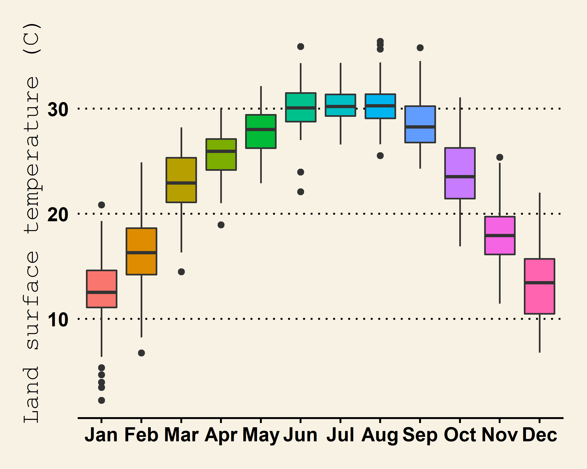

```{r setup, include = FALSE,echo=FALSE}
library("papaja") # formatting library
# loading R libraries
library(tidyverse)  # add  data analysis including ggplot
library (raster)       # raster data
library(rasterVis)   # raster visualization     
library(sp)          # spatial data processing          
library(rgdal)       # spatial data processing      
library(RStoolbox)   # Image analysis
library(ggplot2)     # plotting
library(gridExtra)   # plot arrangement
library(lubridate)  # date time
library(ggpubr) # arranging plots
library(ggspatial) # annotation 
r_refs("r-references.bib") # add all references 
```


# Introduction

<p align="justify"> Monitoring vegetation over time is an essential component of geographical resource management applications. On-site monitoring is frequently carried out by taking detailed measurements, such as canopy level measurements. In situ measurements are time-consuming, labor-intensive, and difficult to carry out over large geographic areas. Remote sensing, on the other hand, is a very viable option for monitoring numerous vegetation characteristics using various vegetation indices such as Normalized Difference Vegetation Index, Near-Infrared / Red Ratio, Soil and atmospherically resistant vegetation index [@im2008hyperspectral]. The natural and anthropogenic features found on the Earth's surface are referred to as land cover. Examples include deciduous forests, wetlands, developed/built up areas, grasslands, and water. Land use, on the other hand, describes the activities that take place on the land and indicates the current use of the land. Examples include residential homes, shopping centers, tree nurseries, state parks, and reservoirs. Land cover and land use are frequently studied together in remote sensing studies because satellite imagery and aerial photography can identify land cover, but inferring land use often requires more knowledge of the study region, so a compromise is sometimes made between identifying the variable of interest and inferring land use [@fonji2014using]. 

Local and place-specific global climate change (LULCC) is a type of global climate change, and these changes add up to global climate change. These changes, in turn, have an impact on other components of our earth-atmosphere system, frequently leading to negative outcomes such as biodiversity loss, desertification, and climate change. Several methods exist for tracking or detecting changes in land cover over time. Previously, researchers mapped LULCC over smaller areas using field data and aerial photographs. Because satellite images can cover large geographic areas and have a long temporal coverage, remote sensing is an excellent tool for studying LULCC [@jensen1986introductory ;@berlanga2002land].</p>

Oktibbeha County experiences the hottest temperatures in July with an average high of $33^o$C.

In this mini paper, the **objectives** are (a) to present results of an analysis of the land surface temperature and precipitation data, (b) to quantify normalized vegetation index for three years and estimate the land use /land cover, (c) to determine the relationship  between vegetation and land use.

# Methods and Materials

## Study area

Oktibbeha County is a micropolitan county in east-central Mississippi that is home to Starkville city and Mississippi State University. The county is located within Mississippi's golden triangle region. The name of the county is derived from a Native American term that means "bloody water" or "icy creek" [@gannett1902origin]. According to the 2020 United States Census, the county had 51,788 people, 17,798 households, and 9,263 families.

## Data collection

Landsat8 imageries (land 8-9 OLI /tirs c2 l1    ) from 2020 to 2022 for February and June with less than 10% cloud were downloaded from USGS earth explorer[https://earthexplorer.usgs.gov/]. Moreover, eight-day composite of Precipitation data from 2000 to 2022 was part of "GPM: Monthly Global Precipitation Measurement (GPM)" . Furthermore, Land Surface Temperature was part of "MOD11A2.006 Terra Land Surface Temperature and Emissivity 8-Day Global 1km" . Then Precipitation and land surface temperature data were clipped with the study area. Then they are converted comma separated format for further analysis.

## NDVI calculation

For the vegetation analysis, we used Normalized Difference Vegetation Index (NDVI).NDVI is a dimensionless index that depicts the difference between the reflectance of vegetation in the visible and near-infrared spectrum.It can be used to assess changes in plant health and vegetation density [@tucker2001higher]. An NDVI is calculated as a ratio of the red (R) value and the near-infrared (NIR) value. It ranges from -1.0 to 1.0, mainly representing greens, where negative values are mainly made up of clouds, snow, and water, and values close to zero are primarily made up of rocks and bare soil. A very low NDVI value (0.1 or less) corresponds to empty areas of rocks, sand, or snow. Moderate values (between 0.2 and 0.3) represent shrubs and meadows, while large values (between 0.6 and 0.8) indicate temperate and tropical forests.

for the Landsat 8, the formula is given 
$NDVI=\frac{BAND 5 - Band 4}{Band 5 + Band 4}$

 Band 5-- reflection in the near-infrared spectrum 
 Band 4 -- reflection in the red range of the spectrum 
 
## Correlation analysis 

Correlation analysis is a statistical method used to examine the relationship between two or more variables. The correlation coefficients range between -1 and 1. 0 indicates no relationship between variables, -1 indicates negative, and +1 indicates positive correlation.
 The equation of Correlation Coefficient is given below.
 
$\rho_{X, Y}=\frac{\operatorname{cov}(X, Y)}{\sigma_{X} \sigma_{Y}}=\dfrac{\sum_{i=1}^{n}\left(X_{i}-\bar{X}\right)\left(Y_{i}-\bar{Y}\right)}{\sqrt{{\Sigma}_{\Sigma_{i}=1}^{n}\left(X_{i}-\bar{X}\right)^{2}} \sqrt{{\sum}_{\Sigma_{i}=1}^{n}\left(Y_{i}-\bar{Y}\right)^{2}}}$


## Land surface temperature and precipitation data analysis

```{r include = FALSE,echo=FALSE}
# reading data
lst<- read_csv("data/landsurface temperature2010_22.csv")
Prci<-read_csv("data/Precipitation1998_19.csv")

```

## Landsate satellite imageries preprocessing


```{r message=FALSE, warning=FALSE,echo=FALSE}
# loading raster and meta data 
# Landsat 8-9 OLI/TIRS C2 L1
# un zipping 
# for (i in 1:5){
#   untar(list.files()[i],exdir=substr(list.files()[i],1,40))
#   print(paste0('finished untaring /unzipping',list.files()[i]))}
# 
# meta<- list.files('data/raster_vector',pattern = '.txt')
# meta
```

```{r echo=FALSE}
# empty vector 
# metafiles<- c()
# # append all names in the metafile vector 
# for (i in 1:4){
#   mfilesnames<-paste0('meta_',substr(meta[i],18,25))
#   metafiles<- c(metafiles, mfilesnames)
# }
# 
# print(metafiles)
```

```{r}
# read meta data 
#meta_20191203<- readMeta('data/raster_vector/LC08_L1TP_022037_20220314_20220322_02_T1_MTL.txt')

```

```{r echo=FALSE}
# read shapefile
# study<-shapefile('data/raster_vector/Oktibbeha.shp')
# read all raster files
# rasters_raw<- Sys.glob('data/raster_vector/*.TIF')
# metafile<-Sys.glob('data/raster_vector/*.txt')
# # just one file for reprojection 
# new_Rast<- raster(rasters_raw[1])
# # reproject
# study<- spTransform(study, proj4string(new_Rast)) 

```

```{r echo=FALSE}

# # 2020_02
# setwd('D:\\home_tower\\Home\\hahmad\\R\\LC08_L1TP_022037_20200221_20200822_02_T1')
# list.files()
# metadata1<- readMeta('LC08_L1TP_022037_20200221_20200822_02_T1_MTL.txt')
# lsat=stackMeta('LC08_L1TP_022037_20200221_20200822_02_T1_MTL.txt')     # stack landsat bands 
# summary(lsat)   
# lsat_tra <- radCor(lsat,    # landsat stack
#                    metaData = metadata1,      # metadata (MTL file) 
#                    method = "rad")           # convert DN to radiance
# lsat_tre<- radCor(lsat,        # landsat stack
#                   metaData = metadata1,         # metadata 
#                   method = "apref")              # convert DN top-of-atmosphere reflectance
# 
# study<- spTransform(study, proj4string(lsat_tre)) 
# cropped<- raster::crop(lsat_tre,extent(study))
# masked<- raster::mask(cropped,study)
# raster::writeRaster(masked,filename="W:/Home/hahmad/public/Course/Sprin 2022/WFA8990/milestone project/data/LC08_L1TP_022037_20200221_20200822_02_T1.tif",bylayer=F, overwrite=TRUE, format="GTiff")
# 
# # 2020_06
# setwd('D:\\home_tower\\Home\\hahmad\\R\\LC08_L1TP_022037_20200612_20200823_02_T1')
# metadata1<- readMeta('LC08_L1TP_022037_20200612_20200823_02_T1_MTL.txt')
# lsat=stackMeta('LC08_L1TP_022037_20200612_20200823_02_T1_MTL.txt')     # stack landsat bands 
# lsat_tra <- radCor(lsat,    # landsat stack
#                    metaData = metadata1,      # metadata (MTL file) 
#                    method = "rad")           # convert DN to radiance
# lsat_tre<- radCor(lsat,        # landsat stack
#                   metaData = metadata1,         # metadata 
#                   method = "apref")              # convert DN top-of-atmosphere reflectance
# 
# study<- spTransform(study, proj4string(lsat_tre)) 
# cropped<- raster::crop(lsat_tre,extent(study))
# masked<- raster::mask(cropped,study)
# raster::writeRaster(masked,filename="W:/Home/hahmad/public/Course/Sprin 2022/WFA8990/milestone project/data/LC08_L1TP_022037_20200612_20200823_02_T1.tif",bylayer=F, overwrite=TRUE, format="GTiff")
# 
# 
# # 2021_02
# setwd('D:\\home_tower\\Home\\hahmad\\R\\LC08_L1TP_022037_20210223_20210303_02_T1')
# metadata1<- readMeta('LC08_L1TP_022037_20210223_20210303_02_T1_MTL.txt')
# lsat=stackMeta('LC08_L1TP_022037_20210223_20210303_02_T1_MTL.txt')     # stack landsat bands 
# lsat_tra <- radCor(lsat,    # landsat stack
#                    metaData = metadata1,      # metadata (MTL file) 
#                    method = "rad")           # convert DN to radiance
# lsat_tre<- radCor(lsat,        # landsat stack
#                   metaData = metadata1,         # metadata 
#                   method = "apref")              # convert DN top-of-atmosphere reflectance
# 
# study<- spTransform(study, proj4string(lsat_tre)) 
# cropped<- raster::crop(lsat_tre,extent(study))
# masked<- raster::mask(cropped,study)
# raster::writeRaster(masked,filename="W:/Home/hahmad/public/Course/Sprin 2022/WFA8990/milestone project/data/LC08_L1TP_022037_20210223_20210303_02_T1.tif",bylayer=F, overwrite=TRUE, format="GTiff")
# 
# 
# 
# # 2021_06
# setwd('D:\\home_tower\\Home\\hahmad\\R\\LC08_L1TP_022037_20210615_20210622_02_T1')
# metadata1<- readMeta('LC08_L1TP_022037_20210615_20210622_02_T1_MTL.txt')
# lsat=stackMeta('LC08_L1TP_022037_20210615_20210622_02_T1_MTL.txt')     # stack landsat bands 
# lsat_tra <- radCor(lsat,    # landsat stack
#                    metaData = metadata1,      # metadata (MTL file) 
#                    method = "rad")           # convert DN to radiance
# lsat_tre<- radCor(lsat,        # landsat stack
#                   metaData = metadata1,         # metadata 
#                   method = "apref")              # convert DN top-of-atmosphere reflectance
# 
# study<- spTransform(study, proj4string(lsat_tre)) 
# cropped<- raster::crop(lsat_tre,extent(study))
# masked<- raster::mask(cropped,study)
# raster::writeRaster(masked,filename="W:/Home/hahmad/public/Course/Sprin 2022/WFA8990/milestone project/data/LC08_L1TP_022037_20210615_20210622_02_T1_MTL.tif",bylayer=F, overwrite=TRUE, format="GTiff")
# 
# # 2022_03
# setwd('D:\\home_tower\\Home\\hahmad\\R\\LC08_L1TP_022037_20220314_20220322_02_T1')
# metadata1<- readMeta('LC08_L1TP_022037_20220314_20220322_02_T1_MTL.txt')
# lsat=stackMeta('LC08_L1TP_022037_20220314_20220322_02_T1_MTL.txt')     # stack landsat bands 
# lsat_tra <- radCor(lsat,    # landsat stack
#                    metaData = metadata1,      # metadata (MTL file) 
#                    method = "rad")           # convert DN to radiance
# lsat_tre<- radCor(lsat,        # landsat stack
#                   metaData = metadata1,         # metadata 
#                   method = "apref")              # convert DN top-of-atmosphere reflectance
# 
# study<- spTransform(study, proj4string(lsat_tre)) 
# cropped<- raster::crop(lsat_tre,extent(study))
# masked<- raster::mask(cropped,study)
# raster::writeRaster(masked,filename="W:/Home/hahmad/public/Course/Sprin 2022/WFA8990/milestone project/data/LC08_L1TP_022037_20220314_20220322_02_T1.tif",bylayer=F, overwrite=TRUE, format="GTiff")

```

Landsat sensors capture reflected energy and store data as 8-bit digital numbers (DNs). USGS data includes metadata. The first step is to convert DN to radiance and then radiance to top of reflectance by using provided metadata.

### Radiometric calibration and Atmospheric Correction 

#### Conversion DN values to spectral radiance

```{r echo=FALSE}

# read meta data 
#metadata1<- readMeta('data/raster_vector/LC08_L1TP_022037_20200612_20200823_02_T1_MTL.txt')
#lsat=stackMeta('data/raster_vector/LC08_L1TP_022037_20200612_20200823_02_T1_MTL.txt')     # stack landsat bands 
#summary(lsat)   
#lsat_tra <- radCor(lsat,    # landsat stack
 #                  metaData = metadata1,      # metadata (MTL file) 
#                   method = "rad")           # convert DN to radiance
#lsat_tra

```

#### Conversion of spectral radiance to reflectance

```{r echo=FALSE}

#lsat_tre<- radCor(lsat,        # landsat stack
#                  metaData = metadata1,         # metadata 
 #                 method = "apref")
# wrting raster files
#raster::writeRaster(masked,filename="W:/Home/hahmad/public/Course/Sprin #2022/WFA8990/milestone #project/data/LC08_L1TP_022037_20200612_20200823_02_T1.tif",bylayer=F, #overwrite=TRUE, format="GTiff") 

```


```{r echo=FALSE}
data2020_06<- raster::stack('data/raster_vector/LC08_L1TP_022037_20200612_20200823_02_T1.tif')
names(data2020_06)<-paste0(rep("B", times = 10, length.out = NA, each = 1),1:10)
#NDVI=\frac{BAND 5 - Band 4}{Band 5 + Band 4}
ndvi_2020_06<- (data2020_06$B5-data2020_06$B4/data2020_06$B5+data2020_06$B4)
## Set up color gradient with 100 values between 0.0 and 1.0
breaks <- seq(-1, 1, by = 0.09)
cols <- colorRampPalette(c("red", "yellow", "lightgreen"))(length(breaks) - 1)
ndvi_2020_06<- raster::projectRaster(ndvi_2020_06,crs="+proj=longlat +datum=WGS84 +no_defs ")
## Use `at` and `col.regions` arguments to set the color scheme
# ndvi_2020_06_plot<-rasterVis::levelplot(ndvi_2020_06, at = breaks, col.regions = cols)
# # saving plot
# png(file = "Figures_or_Maps/ndvi_2020_06.png", bg = "transparent", width=1800, height=1800, res=300)
# print(ndvi_2020_06_plot)


reclass<-matrix(c(-Inf,-1,0,
                  -1,0,1,
                  -1,0,1),ncol=3)
# reclassify the raster using the reclass object - reclass_m
chm_classified <- reclassify(ndvi_2020_06,
                     reclass)

ndvi2020_2<- ggplot(data = as.data.frame(chm_classified ,xy=TRUE)) +
  #geom_raster(aes(x = x, y = y, fill = as.character(layer))) + 
  geom_tile(aes(x, y, fill=as.character(layer)))+
  scale_fill_manual(name = "NDVI",
                    values = c('black','red','grey','green'),
                    labels = c('No data','Bed','baresoil','Good'),
                    na.translate = FALSE) +
  coord_sf(expand = F,crs=3160) +
  theme(axis.title.x = element_blank(),
        axis.title.y = element_blank(),
        axis.text.x = element_blank(),
        axis.text.y = element_blank(),
        panel.background = element_rect(fill = "white", color = "black"))+
  # spatial-aware automagic scale bar
  annotation_scale(location = "tl") +
  # spatial-aware automagic north arrow
  annotation_north_arrow(location = "br", which_north = "true")

ggsave("Figures_or_Maps/ndvi_2020_06.png",plot=ndvi2020_2,device="png",dpi=500)
```

```{r echo=FALSE}
# #library(magick)
# # may be fixed later
# ndvifile<- image_read('Figures_or_Maps/ndvi_2020_06.png')
# right_png <- image_convert(ndvifile, "png")
# image_write(right_png, path = "Figures_or_Maps/ndvi_2020_06.png", format = "png")
```


# Results


## Mapping


```{r echo=FALSE}
classify_raster <- function(trainshp, rasterfile){
  # training sample
  sampl<- terra::vect(trainshp)
  # random sample
  ptsampl<- terra::spatSample(sampl,1000,method='random')
  # make matrix
  xy<-as.matrix(geom(ptsampl)[,c('x','y')])
  # extract data
  df<- raster::extract(rasterfile,xy)[,-1]
  # data frame of sample
  sampdata<- data.frame(class=ptsampl$Classname,df)
  # set up model and train model
  cartmodel<-rpart::rpart(as.factor(class)~., data=sampdata)
  # predict classes
  classified<- predict(rasterfile,cartmodel,type='class',na.rm=TRUE)
  lulc<- which.max(classified)
  cls<- names(classified)
  df<- data.frame(id=1:5,class=cls)
  levels(lulc)<- df
  calculated_Area<-as.data.frame(zonal(area(classified),classified,'sum'))
  colnames(calculated_Area)<- c('class','area_km')
 calculated_Area$class<- c('Baresoil','Built up','Roads','Vegetation','Water')
 calculated_Area$area_km<- calculated_Area$area_km/1e+6
  return(c(classified,df,calculated_Area))

}
# apply function 
classified2020<-classify_raster('data/raster_vector/training_sample.shp',raster::stack('data/raster_vector/LC08_L1TP_022037_20200612_20200823_02_T1.tif'))
# plotting 
p2020_2<- ggplot(data = as.data.frame(classified2020[[1]],xy=TRUE)) +
  geom_raster(aes(x = x, y = y, fill = as.character(layer_value))) + 
  scale_fill_manual(name = "Land cover",
                    values = c("#CDC0B0", "#FF4040", "#EED5B7", "#458B00", "#104E8B"),
                    labels = c('Baresoil','Built up','Roads','Vegetation','Water'),
                    na.translate = FALSE) +
  coord_sf(expand = F,crs=3160) +
  theme(axis.title.x = element_blank(),
        axis.title.y = element_blank(),
        axis.text.x = element_blank(),
        axis.text.y = element_blank(),
        panel.background = element_rect(fill = "white", color = "black"))+
  # spatial-aware automagic scale bar
  annotation_scale(location = "tl") +
  # spatial-aware automagic north arrow
  annotation_north_arrow(location = "br", which_north = "true")

# subplots
landcover<-ggarrange(p2020_2, p2020_2, p2020_2,p2020_2,nrow = 2,ncol=2,labels = c("a","b","c","d"),label.x=0.9,common.legend = TRUE)
# save it 
ggsave("Figures_or_Maps/landcover.png",plot=landcover,device="png",dpi=500)
```

## Land surface temperature and precipitation


```{r echo=FALSE}
# date change character to date time from lubridate library
lst$date<- mdy(lst$date)
Prci$date<- mdy(Prci$date)
# adding column as month 
lst$Month<- month(lst$date,label = TRUE)
Prci$Month<- month(Prci$date,label = TRUE)
# making table as descriptive statistics
lst_description<- lst %>% 
  group_by(Month) %>% 
  summarize(Mean=round(mean(LST_Day_1km,na.rm=TRUE),2),
            Median=round(median(LST_Day_1km,na.rm=TRUE),2),
            Max=round(max(LST_Day_1km,na.rm=TRUE),2),
            Min=round(min(LST_Day_1km,na.rm=TRUE),2),
            SD=round(sd(LST_Day_1km,na.rm=TRUE),2))
lst_description[,-1] <- printnum(lst_description[,-1])


```

## precipiation works

```{r echo=FALSE}
# same descriptive table
prc_description<- Prci %>% 
  group_by(Month) %>% 
  summarize(Mean=round(mean(precipitation,na.rm=TRUE),2),
            Median=round(median(precipitation,na.rm=TRUE),2),
            Max=round(max(precipitation,na.rm=TRUE),2),
            Min=round(min(precipitation,na.rm=TRUE),2),
            SD=round(sd(precipitation,na.rm=TRUE),2))
prc_description[,-1] <- printnum(prc_description[,-1])


```

```{r echo=FALSE, results=FALSE}
# they are used for writing 
tmp_mean<-mean(round(as.numeric(lst_description$Mean),0))
tmp_sd<-mean(round(as.numeric(lst_description$SD),0))
```

Throughout the year, the average land surface temperature (LST) ranges from 9 $^0C$ to 28 $^0C$. January has the coldest LST at 9.16 $^0C$, and July has the hottest LST at 28.55$^0C$. According to data recorded between 2010 and 2022, January and December experienced the lowest LST, ranging from -0.5 to -0.3$^0C$, whereas August and June experienced higher LST, ranging from 35.5 $^0C$ to 33.77$^0C$ (see table 1).
```{r echo=FALSE, results=FALSE}

lst_month<- ggplot(na.omit(lst)) +
  aes(x = Month, y = LST_Day_1km, fill = Month) +
  geom_boxplot(shape = "circle") +
  scale_fill_hue(direction = 1) +
  scale_color_hue(direction = 1) +
  ggthemes::theme_wsj() +
  theme(legend.position = "none")+
 ggplot2::labs(
    x = "Months",
    y = "Land surface temperature (C)",
    fill = "Month"
  ) +
  theme(axis.title.y = element_text(size=15))

#ggsave(plot=lst_month,path='Figures_or_Maps',file='lst_month.png',dpi = 300,scale = 3.5, #width = 3,height = 2, units = "in")
ggsave("Figures_or_Maps/lst_month.png",plot=landcover,device="png",dpi=500)

```


```{r echo=FALSE,fig.cap='Boxplot of Land surface temperature'}


```

Monthly average temperature is `r printnum(tmp_mean)` $^0C$ and standard deviation is `r printnum(tmp_sd)`

```{r}
apa_table(lst_description,
          caption = '1. Descriptive statistics of Land surface temperature',
          note = 'MOD11A2.006 Terra Land Surface Temperature and Emissivity 8-Day Global 1km ',
          escape = TRUE)
```

Monthly precipitation data covered a period of over 20 years. During this period, the average precipitation rate ranged from 0.12 to 0.22 $mm/hr$. These rates remained relatively constant throughout the month. December to April had a higher precipitation rate of around 0.40 $mm/hr$, while August to November had a lower rate ranging from 0.05 to 0 $mm/hr$. 

```{r}
apa_table(prc_description,
          caption = '2. Descriptive statistics of Precipitation (mm/hr)',
          note = 'GPM: Monthly Global Precipitation Measurement (GPM) v6 ',
          escape = TRUE)
```

```{r echo=FALSE,fig.cap='Normalized Difference Vegetation Index Map of Oktibbeha County'}
knitr::include_graphics('Figures_or_Maps/ndvi_2020_06.png')
```

```{r echo=FALSE,fig.cap='Land cover /Land use map of oktibbeha county  '}


```
## Discussion


# Conclusion

\newpage

# used R libraries

We used `r cite_r("r-references.bib")` for all our analyses.

# References

```{=tex}
\begingroup
\setlength{\parindent}{-0.5in}
\setlength{\leftskip}{0.5in}
```
::: {#refs custom-style="Bibliography"}
:::

```{=tex}
\endgroup
```
